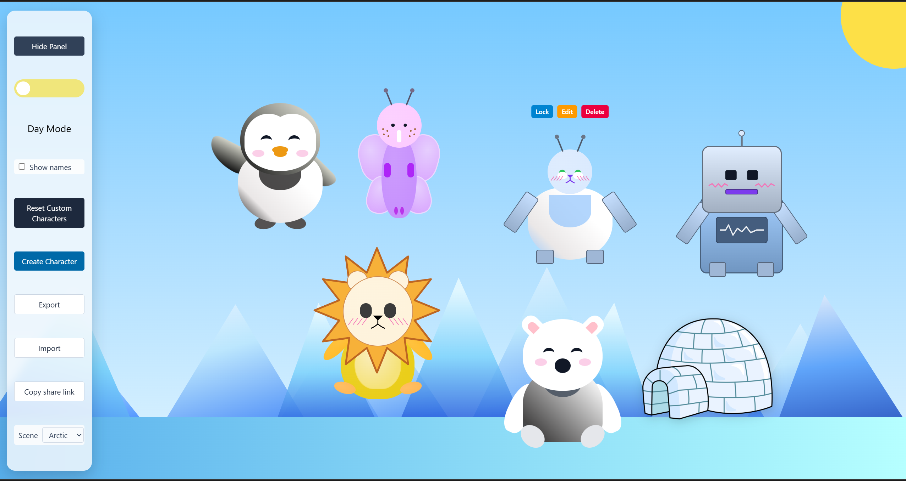
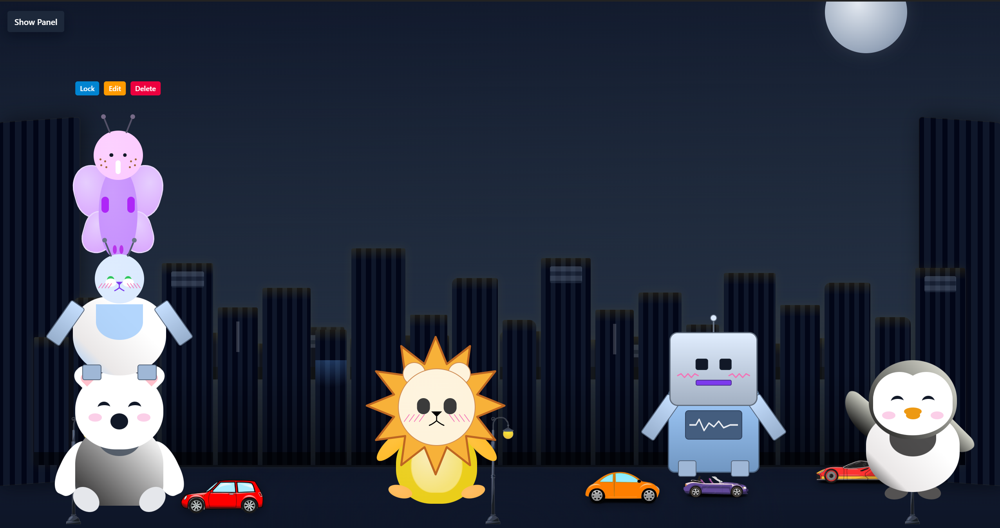
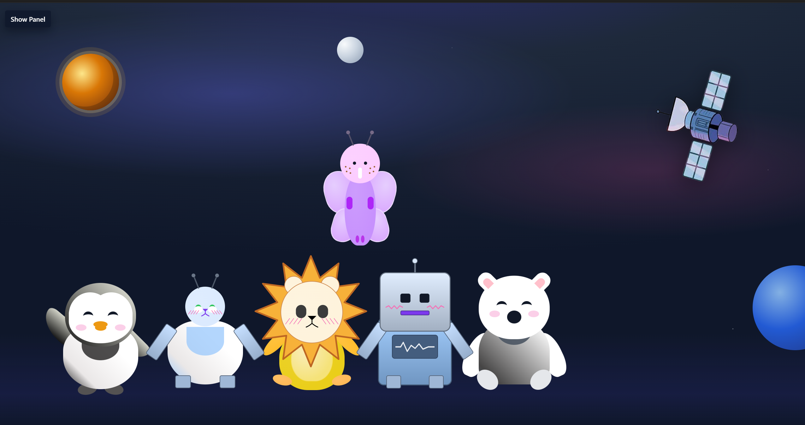

# Arctic Page

A browser **scene playground** built with **React 19** and **Vite**. Pick a themed background, toggle **day and night**, drag **CSS-built characters** around the page, and design **custom characters** in the creator. Settings persist in **`localStorage`** so your layout survives refresh.

---

## Features

| Area | What you get |
|------|----------------|
| **Scenes** | Six fullscreen presets: Arctic, Desert, Ocean, City, Forest, Space — each with layered artwork (CSS and PNG assets where used). Scene CSS is **split per scene** and **lazy-loaded** with the scene component so inactive presets are not loaded up front. |
| **Characters** | Built-in **penguin** and **polar bear** presets plus up to **six custom** characters from the creator (mix-and-match parts and colors). On **narrow viewports (≤480px width)** the playground uses a **smaller character box** so about three figures fit with slight overlap; positions stay **clamped** to the viewport on drag and resize. |
| **Interaction** | **Pointer drag** (with **pointer capture** on the playground) to move characters; **`touch-action: none`** on draggable figures reduces accidental page scroll on touch devices. **Tab** to focus a character and **arrow keys** to nudge — step size **scales with character width** (see `getKeyboardNudgePx` in `src/constants/motion.ts`). **Click a character** for the action toolbar (Lock / Unlock, Edit / Delete for customs). Locked characters **pause wandering** but can still be dragged or nudged. **Wander** step size also scales on smaller character boxes. |
| **Mobile UI (≤480px)** | **Bottom bar** that expands to a **50dvh** sheet with full controls; **character creator** runs **fullscreen** while open (bottom bar hidden). See [`docs/adding-scenes.md`](docs/adding-scenes.md) for breakpoint and scene-layer notes. |
| **Day / night** | Toggle affects scene styling and body backdrop; state is remembered. |
| **Toolbar** | Scene picker, show/hide name labels, editable display names for built-ins, reset custom characters, open creator, **Export** / **Import** (JSON), **Copy share link** (URL hash when the snapshot JSON is small enough). |
| **Persistence** | Night mode, scene, custom characters, positions, locks, name visibility, and built-in names — all stored locally (see `src/utils/storage.ts`). |
| **Accessibility** | Character creator uses a focus trap and dialog semantics; toolbar controls are labeled; ESLint includes **jsx-a11y**. Optional share/import flows announce status with a live region. |
| **Motion** | **`prefers-reduced-motion`** tones down character transitions, wandering, ocean waves/fish, and legacy penguin/bear decorative animations. |
| **Deploy** | Static `dist/` output; see [`docs/DEPLOY.md`](docs/DEPLOY.md) for **`vite` `base`** on GitHub Pages and other hosts. A light **[Web App Manifest](public/manifest.webmanifest)** is linked for theme/name hints (no service worker). |

---

## Tech stack

- **React 19**, **TypeScript**, **Vite 6**
- **Tailwind CSS** (via `index.css`) for control chrome and modal utilities; large scene styling lives in **`styles.css`** (global + character UI) and **`src/components/backgrounds/scenes/*.scene.css`** (per scene)
- **Vitest** + **happy-dom** for unit tests (motion/layout helpers, `readPhoneLayout`, **preset JSON** parse checks); **ESLint** (`typescript-eslint`, React Hooks, React Refresh, jsx-a11y)
- **GitHub Actions** CI: `npm ci` → lint → test → build (see [.github/workflows/ci.yml](.github/workflows/ci.yml))

---

## Requirements

- **Node.js** 22 or newer (see `.nvmrc` and `package.json` `engines`; aligned with CI).
- **[npm](https://docs.npmjs.com/cli/)** only — this repo uses **`package-lock.json`**. Ignore or delete stray **`pnpm-lock.yaml`** / **`yarn.lock`** (also listed in `.gitignore`).

---

## Scripts

| Command | Description |
|---------|-------------|
| `npm install` | Install dependencies |
| `npm run dev` | Dev server ([Vite](https://vitejs.dev/), default port **5173**) |
| `npm run build` | Typecheck (`tsc -b`) and production build → **`dist/`** |
| `npm run preview` | Serve the production build locally |
| `npm run lint` | ESLint on `src/` |
| `npm run test` | Vitest (single run) |
| `npm run test:watch` | Vitest watch mode |

---

## Documentation

| Doc | Purpose |
|-----|---------|
| [`docs/README.md`](docs/README.md) | Index: scenes, character templates, deploy, presets |
| [`docs/DEPLOY.md`](docs/DEPLOY.md) | Hosting, **`base`** path, static-site notes |
| [`docs/adding-scenes.md`](docs/adding-scenes.md) | New scene presets, CSS, mobile `@media` checklist |
| [`docs/adding-character-templates.md`](docs/adding-character-templates.md) | Creator part variants |
| [`presets/README.md`](presets/README.md) | **Importable playground JSON** (see below) |

---

## Screenshots

Stills and screen recordings live under [`docs/media/`](docs/media/). See [`docs/media/README.md`](docs/media/README.md) for a file list and replacement tips.

| Arctic (day) | City (night) |
|--------------|--------------|
|  |  |

**Space (group):**

**Character creator — mobile (narrow viewport):**

**Character creator — desktop:**

---

## Playground presets

Curated **Import** snapshots live in [`presets/playground/`](presets/playground/). Full instructions: [`presets/README.md`](presets/README.md).

**Quick try:** `default-arctic-day.json`, `city-night.json`, `forest-with-custom-lion.json`, `ocean-locked-penguin.json`.

---

## License

[ISC](https://opensource.org/licenses/ISC) — see [`package.json`](package.json).
